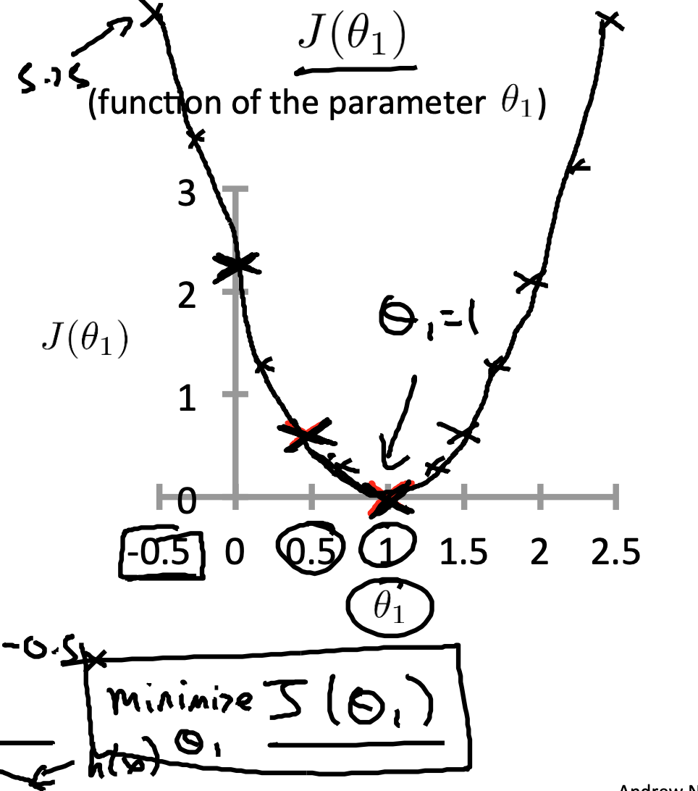
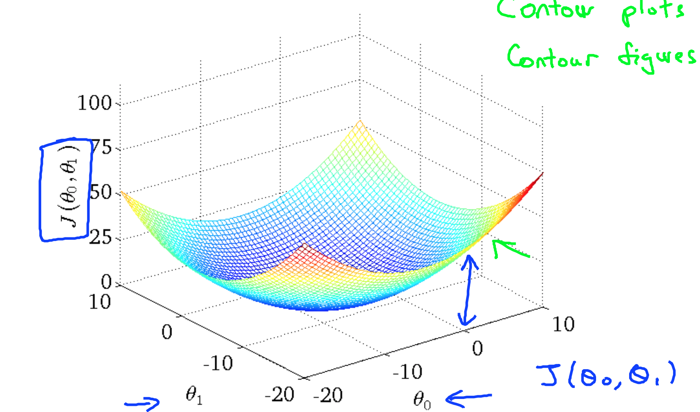
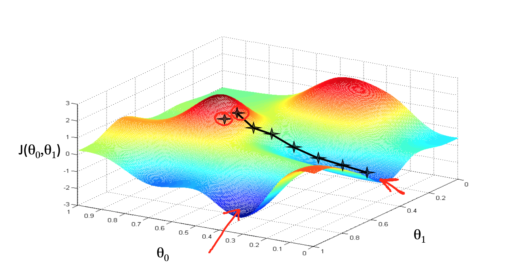

机器学习基础
===

## 0. 回归分析(regression analysis)

统计学中，回归分析指的是确定两种或两种以上变量间相互依赖的定量关系的一种统计分析方法。
+ 自变量的多少：一元回归/多元回归
+ 因变量的多少：简单回归/多重回归
+ 关系类型：线性回归/非线性回归

## 1. 线性回归(linear regression)
y = f(x), 首先，假设变量y和变量x之间的关系是线性的，即可以表示为x中元素的加权和，这里通常允许包含观测值的一些噪声； 其次，我们假设任何噪声都比较正常，如噪声遵循正态分布。

### 1.1 一元线性回归

以最简单的一元一次(Linear regression with one variable)举例: 

+ 假设函数(hypothesis): $h_\theta(x) = \theta_0 + \theta_1x $ (或理解为$x_0$恒为1,只有一个变量$x_1$) 
+ 损失函数(cost function): $J(\theta) = \frac{1}{2m}\sum(h_\theta(x)-y)^2$
+ 目标: $\min\limits_{\theta_0,\theta_1}J(\theta)$ 
+ 梯度下降(Gradient descent algorithm): repeat util convergence {
  
    $\theta_j = \theta_j - \alpha \frac{\partial}{\partial \theta_j} J(\theta_0,\theta_1)$

    $j = 0: \frac{\partial}{\partial\theta_0}J(\theta_0,\theta_1) 
    = \frac{\partial}{\partial\theta_0}\frac{1}{2m}\sum(\theta_0 + \theta_1x-y)^2$

    $=\frac{1}{2m}\sum2*(\theta_0+\theta_1x-y) * 1$
    
    $=\frac{1}{m}*\sum(\theta_0+\theta_1x-y)$

    $j = 1: \frac{\partial}{\partial\theta_1}J(\theta_0,\theta_1) 
    = \frac{\partial}{\partial\theta_1}\frac{1}{2m}\sum(\theta_0 + \theta_1x-y)^2$

    $=\frac{1}{2m}\sum2*(\theta_0+\theta_1x-y) * x$
    
    $=\frac{1}{m}*\sum(\theta_0+\theta_1x-y)$

    $即: \frac{1}{m}*\sum\limits_{i=1}^m(\theta_0+\theta_1x^i-y)$

    (分步求导或是把平方展开一步直接求导，按照求和展开来理解)

    }

 在我们开始考虑如何用模型拟合（fit）数据之前，我们需要确定一个拟合程度的度量。 损失函数（loss function）能够量化目标的实际值与预测值之间的差距。 
$J(\theta)$是$\theta$的二次函数，x,y都为已知常数，可以直接求导(即解析解)，找出极值点。或是通过梯度下降寻找最优解。
+ 解析解 TODO 线性回归的解析解
+ 随机梯度下降 几乎可以训练所有的深度学习模型,通过不断地在损失函数递减的方向上更新参数来降低误差。

梯度下降最简单的用法是计算损失函数（数据集中所有样本的损失均值） 关于模型参数的导数（在这里也可以称为梯度）。 但实际中的执行可能会非常慢：因为在每一次更新参数之前，我们必须遍历整个数据集。 因此，我们通常会在每次需要计算更新的时候随机抽取一小批样本， 这种变体叫做小批量随机梯度下降（minibatch stochastic gradient descent）。

### 1.2 理解损失函数
如果$x_0$恒为0 ，则就只有$x_1$，$\theta_1$ ,则损失函数如下：

若是既有$\theta_0也有\theta_1$，则是

随机梯度下降：

### 1.3 多元线性回归及线性代数

Linear Regression with multiple variables,

+ Hypothesis: $h_\theta(x) = \theta^Tx = \theta_0x_0 + \theta_1x_1 + \theta_2x_2 + \cdots + \theta_nx_n$
+ Parameters: $\Theta (\theta_0,\theta_1,\theta_2,\ldots,\theta_n )$
+ Cost Function: $J(\theta)=\frac{1}{2m}\sum(h_\theta(x^{(i)})-y^{(i)})^2$
+ Gradient descent: repeat {

    $\theta_j := \theta_j - \alpha \frac{1}{m} \sum\limits_{i=1}^m(h_\theta(x^i)-y^i)x_j^i$

    $x_0^i = 1$
    
    }

### 1.4 Feture Scaling & Mean normalization ###

### 1.5 线性回归从0实现 ###

#### 1.5.1 生成数据集 #### 

先假定一个线性模型，生成数据集，然后再恢复这个模型的参数。
假设模型为：

$ y = w * X +b + \epsilon$

$ w = [5,3.8] ^ T$ 

$ b = 8.3 $

#### 1.5.2 定义模型 #### 

## 逻辑回归

### 感知机

### softmax

您已选择报名民办学校，请务必点击【确认提交】按钮完成报名。您将收到民办学校报名成功短信， 或者登录“一网通办”网站（ zwdt.sh.gov.cn ）义务教育入学专栏或“上海市义务教育入学报名系统”（ shrxbm.edu.sh.gov.cn ）进行查询，请注意查收。